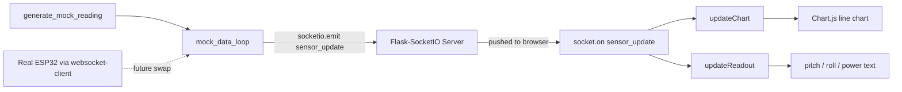

# Dashboard (Debug View)

Live sensor dashboard for the stabilization platform. Currently running
on mock data (a fake damped-oscillation signal) while  awaiting the real
JSON schema and hardware endpoint 

## How it works



## Setup

1. Make sure you have Python 3.9+ installed (`python3 --version` to check).

2. From this `dashboard/` folder, create and activate a virtual environment:
   ```
   python3 -m venv env
   source env/bin/activate        # Windows: env\Scripts\activate
   ```

3. Install dependencies:
   ```
   pip install -r requirements.txt
   ```

4. Run the server:
   ```
   python app.py
   ```

5. Open a browser to:
   ```
   http://localhost:5001
   ```
   You should see the dashboard with the "MOCK DATA" badge, a live-updating
   chart, and the pitch/roll/power readout changing once a second.

## Viewing from another device (phone, another laptop)

The server is already bound to your machine's network address (not just
localhost), so as long as the other device is on the **same WiFi network**:

1. Find this machine's local IP address:
   - Mac: `ipconfig getifaddr en0`
   - Windows: `ipconfig` (look for IPv4 Address)
2. On the other device, go to `http://<that-ip>:5001`

## Extra info

- **Port 5001, not 5000**: macOS runs AirPlay Receiver on port 5000 by
  default, which blocks Flask from using it. If you ever see a 403 error on
  port 5000, this is why.
- **Firewall prompt**: the first time you run this, macOS may ask whether to
  allow incoming network connections for Python. Allow it, or other devices
  won't be able to reach the dashboard.

## File structure

```
dashboard/
  app.py                  <- Flask server + mock data generator
  templates/
    index.html             <- page structure
  static/
    js/dashboard.js         <- Socket.IO listener + Chart.js live update
    css/style.css           <- styling
  requirements.txt
```


